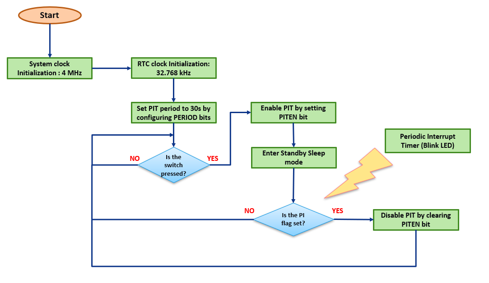

<!-- Please do not change this logo with link -->

# Configure external 32.768kHz crystal as a RTC clock source in sleep using AVR128DB48

This code example demonstrates how to configure an external 32.768kHz crystal as a clock source to the Real-Time Counter (RTC) module of AVR microcontrollers. In this code example, RTC module of AVR128DB48 microcontroller is Supplied with an external 32.768kHz crystal clock source while the microcontroller is in sleep mode (power down mode).

## Introduction

In many of real world applications which are battery operated, the microcontroller is dependent on methodical sleep mode techniques that shuts down some or all peripheral operations to reduce power consumption, enabling it to work for longer time on limited resources. The AVR128DB48 microcontrollers of the AVR® DB family of microcontrollers family uses the latest technologies from Microchip with a flexible and low-power architecture. The AVR128DB48 simplified set of features. It includes Real-Time Counter (RTC), which offers two timing  functionalities in form of RTC and Periodic Interrupt Timer (PIT). The PIT functionality uses the same clock source as RTC but can be enabled independently. The objective of this example is to showcase the working of RTC in sleep mode (power down mode) using external crystal as clock source. It will show the power consumption by the device in sleep mode and how external crystal as clock is accurate and consumes less power than the internal HF oscillator.

## Useful Links

- [Microchip University Courses](https://mu.microchip.com/page/all-courses)
- [AVR128DB48 Product Page](https://www.microchip.com/en-us/product/AVR128DB48)

## Description

The objective of this code example is to enable low-power power-down mode in the microcontroller and configure the RTC module to operate in periodic interrupt timer (PIT) mode using an external 32.768kHz crystal oscillator, and completely shut down the microcontroller system clock and peripherals. Thereby, the microcontroller wakes up from sleep to a PIT periodic interrupt. This implementation helps to minimize the microcontroller average power consumption. For the demonstration purpose the switch event is used to switch to external crystal oscillator as the clock source and let the microcontroller enter sleep mode. After the RTC period elapse, the PIT interrupt occurs and the clock source for the microcontroller switches back to internal HF oscillator and is in active mode.

  
   Figure 1: System Block Diagram 

## Software  Tools
Microchip’s free IDE, compiler and graphical code generators are used throughout the application firmware development. Following are the tools used for this demo application:

* MPLAB® X IDE [v6.05.0 or newer](https://www.microchip.com/mplab/mplab-x-ide)
* XC8 Compiler [v2.40.0 or newer](https://www.microchip.com/mplab/compilers)
* MPLAB Data Visualizer [v1.3.1160]( https://www.microchip.com/en-us/tools-resources/debug/mplab-data-visualizer)
* Microchip AVR-Dx_DFP Series Device Support Pack [2.3.272 or newer](https://packs.download.microchip.com/#collapse-Microchip-AVR-Dx-DFP-pdsc)
* MPLAB® Code Configurator [v5.2.2 or newer](https://www.microchip.com/mplab/mplab-code-configurator)
* RTC 4.2.4
* SLPCTRL 3.0.4

***Note: For running the demo, the installed tool versions should be the same or later. This example is not tested with the previous versions.***

## Hardware Tools

* [AVR128DB48 Curiosity Nano](https://www.microchip.com/en-us/development-tool/EV35L43A)
* [Power Debugger](https://www.microchip.com/en-us/development-tool/atpowerdebugger)

## Application Firmware

The example firmware uses RTC peripheral to showcase the working of microcontroller in sleep mode by using 32.768kHz external crystal oscillator as its clock source. During the active period the system works of the 4MHz internal oscillator. The sleep control system peripheral is configured in power down mode with the performance mode being set to auto. Here, in Power-Down sleep mode, only the Periodic Interrupt Timer (PIT) functionality is available. The PIT uses the same clock source as RTC functionality. The RTC period is configured for 30s. If a switch press event is detected, the RTC peripheral gets enabled, and the system enters the power down mode. The RTC flag is monitored to check if the RTC period is completed via interrupt service routine. After RTC period of 30s is completed, the device wakes up from sleep. As soon as it wakes up, the RTC peripheral gets disabled and the MCU continues to stay in active mode until a new switch press event is detected.

  
   Figure 2: Application Firmware Flowchart 

## Appendix

MCC – MPLAB® Code Configurator is a graphical programming environment that generates seamless, easy to understand C code to give a head start to the project, saving the designer’s time to initialize and configure all the modules, and to go through the datasheets. Using an instructive interface, it enables and configures all peripherals and functions specific to the application requirements.

**Start by creating a new Project and open MCC**

* Open MPLAB X IDE
* Go to File > New Project
* Select Microchip Embedded > Standalone Project
* Enter the device name. In this case, select AVR128DB48 device
* Name the project
* Launch MCC tool by navigating to **“Tools -> Embedded -> MPLAB Code Configurator v4: Open/Close”**. Alternatively, click the MCC icon to launch the MCC tool.

## System configuration

* **System Clock**
Open **Clock Control** setup present under **System** dropdown menu in **Project Resources** tab.

* Clock Selection	: **Internal high-frequency Osc**
* Internal Osc. Freq.	: **1-32MHz internal Osc**
* Enable System Clock Out
* Enable Run Standby 32.768kHz crystal oscillator
* Enable Low Power Mode

The following figure shows the system configuration setting in MCC tool.

  
   Figure 3: System Configuration 

* **SLPCTRL**
Open **SLPCTRL** setup present under **System** dropdown menu in **Project Resources** tab.

* Enable Sleep
* Sleep Mode  		: **PDOWN**
* Performance Mode  	: **AUTO**

  
   Figure 4: Sleep Control Configuration 

* **RTC**

Open **RTC** setup present under **Driver** dropdown menu in **Project Resources** tab.

* Enable RTC
* RTC Clock Source	: **32.768kHz from XOSC32K**
* Pre-scaling Factor	: **RTC Clock/32768**
* Compare (s)		: **30**
* Enable Compare Match Interrupt

  
   Figure 5: RTC Configuration 

## Pin Mapping
The following images informs about the pin usage in the project.

  
   Figure 6: Pin Mapping (List View) 

  
   Figure 7: Pin Mapping (Navigation View) 

## Hardware Setup
The following figure consists of AVR128DB48 Curiosity Nano Evaluation kit along with Power Debugger. Connect the power debugger to the MCU using connecting cables.

  
   Figure 8: Hardware Setup 

## Data Visualizer

* The Data Gateway Interface is available on the Microchip evaluation kits with an embedded programmer and debugger (EDBG) . These evaluation kits can communicate with the data visualizer through DGI. The figure below shows the DGI control panel of data visualizer. All detected DGI devices are listed in the drop-down list with the kit name and serial number. Using the **Connect** button will connect to the selected DGI device and query for available interfaces.

  
   Figure 9: DGI Window 

* The available interfaces will be listed under Interfaces. To enable an interface, check the box next to the name. When an interface is enabled, the sources and sinks can be connected to other endpoints. The Gear button is used to configure the interface. See the interface-specific sections for an explanation of the configuration fields (In this case Power).

  
   Figure 10: Interfaces and Settings 

* To start polling data from the interfaces, click the **Start** button. The Reset MCU check box will cause the MCU to be held in Reset during start. The **Power Analysis** module is made specifically for analyzing power consumption over time.

  
   Figure 11: Power Analysis Window 

* Drag the Channel A Current and Channel A Voltage pins to Channel A Current and Voltage pins of power analysis window, and then measure the current consumption of the microcontroller.

  
   Figure 12: Power Analysis Channel Settings 

## Demo Operation

* Make the hardware connections as shown in the hardware setup. Power up the Curiosity Nano board using micro-USB cable.
* Download the firmware available from the GitHub code example page.
* Build the project using latest version of tools as mentioned in the Software Tools section and flash the generated file on the AVR128DB48 microcontroller.
* Observe the device current consumption on the Data Visualizer Window in the active mode.

  
   Figure 13: Active Current 

* Press the on-board switch. It will switch the clock source to external crystal.

  
   Figure 14: Sleep Current 

* Observe the device current consumption in the sleep mode.
* Wait for 30secs or any further switch press to determine the current consumption in active mode

## Conclusion
The power consumption of microcontroller plays an important role in the battery powered applications. Hence, it is important to keep the microcontroller power consumption as minimum as possible for longer battery life. This code example demonstrates low-power sleep implementation using RTC and external crystal oscillator of AVR128DB48 microcontroller, as the external crystal oscillator provides a better overall performance compared to the internal oscillator and also minimizes the overall power consumptions of the microcontroller.